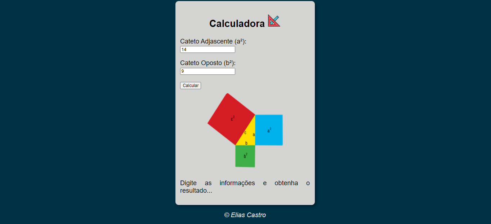
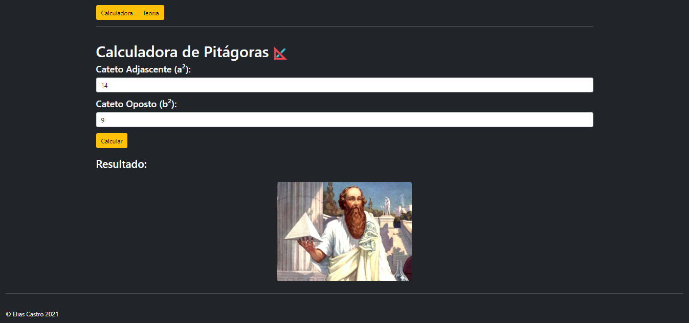

# Processo Seletivo - Estágio Desenvolvimento de Software
 
## O Desafio

"Olá, caro viajante do tempo!

Você retornou ao passado para aproximadamente 535 A.C. e encontrou com o grande
filósofo matemático Pitágoras que naquela época estava pensando em largar tudo e desistir
de seu trabalho. Com isso, o seu retorno ao passado trouxe um enorme desafio, que irá
revolucionar o mundo, mas para isso você precisa provar ao grande filósofo que tudo aquilo
que ele tinha construído até o momento era algo promissor e por isso ele deveria continuar.
A sua missão nessa grande jornada é mostrar para ele que nada foi em vão, e para isso você
precisará desenvolver uma calculadora que será capaz de calcular a relação entre os lados de
um triângulo retângulo (mais conhecido popularmente como teorema de pitágoras)."

## Processo de Desenvolvimento

Para este projeto, realizei a criação do site utilizando inicialmente as ferramentas de HTML5, CSS3 e JavaScript. 

Durante o primeiro modelo do site, senti a necessidade do design responsivo e então procurei aprender as boas praticas com **Bootstrap**, assim melhorando a interface e visualização do meu programa.

O Projeto foi realizado com:
- HTML5 
- CSS3  
- JavaScript 
- Bootstrap5 

Para ver o resultado na integra, [Clique aqui!](https://eliascastrosousa.github.io/DesafioCromai/)

Colabore com este projeto, clique em Code para clonar este repositorio ou [Clique aqui](https://github.com/eliascastrosousa/DesafioCromai/archive/refs/heads/main.zip) e baixe os arquivos deste repositório em formato ZIP. 

